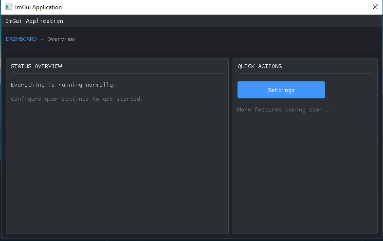

# ImGui Boilerplate


A clean, ready-to-use **Dear ImGui** boilerplate built with **DirectX 9** and **Win32**. Designed as a starting point for desktop GUI applications on Windows — with a proper screen system, component library, dark theme, and Material Symbols icon support baked in.

<p align="center">
  
</p>

> [!IMPORTANT]
> **Font files are not included in this repository** (~200 MB). You must download them manually. See the [Font Setup](#font-setup) section below.

## Features

- **Dear ImGui** with D3D9 + Win32 backend
- **Screen management system** — register and switch screens with `ScreenManager`
- **Dark theme** with a full color palette (`Colors.h`)
- **Reusable UI components** — `Button`, `TextField`, `MessageModal`
- **Material Symbols Rounded** icon font — merged into the default font, usable inline
- **Font manager** — load text fonts, merge icon fonts, retrieve by name
- **Device lost handling** — graceful D3D9 recovery and resize support
- **C++20** — modern language standard

## Project Structure

```
ImGuiBoilerplate/
├── ImGuiApp/
│   ├── main.cpp                         # Entry point & app lifecycle
│   ├── src/
│   │   ├── graphics/
│   │   │   ├── GuiWindow.h/cpp          # Win32 window wrapper
│   │   │   └── GuiRenderer.h/cpp        # D3D9 renderer
│   │   └── ui/
│   │       ├── ImGuiManager.h/cpp       # ImGui init, font loading, theme
│   │       ├── ImGuiRender.h/cpp        # Per-frame begin/render/end
│   │       ├── ScreenManager.h/cpp      # Screen registration & switching
│   │       ├── screens/
│   │       │   ├── IScreen.h            # Screen interface + ScreenType enum
│   │       │   ├── DashboardScreen      # Example dashboard screen
│   │       │   └── SettingsScreen       # Example settings screen
│   │       ├── components/
│   │       │   ├── Button               # Themed button variants
│   │       │   ├── TextField            # std::string input fields
│   │       │   └── MessageModal         # Info/warning/error/confirm modal
│   │       └── style/
│   │           ├── Colors.h             # Color palette constants
│   │           ├── Icons.h              # Material Symbols UTF-8 defines
│   │           ├── Theme.h/cpp          # DarkTheme implementation
│   │           └── Fonts.h/cpp          # FontManager (load, merge, retrieve)
│   └── vendor/
│       ├── ImGui/                       # Dear ImGui source (vendored)
│       └── fonts/                       # ⚠ NOT in repo — download manually
│           └── Material_Symbols_Rounded/
│               └── static/
│                   └── MaterialSymbolsRounded_Filled-Regular.ttf
└── README.md
```

## Requirements

- **Visual Studio 2022** (v145 toolset or newer)
- **Windows SDK 10.0**
- **DirectX 9** — ships with the Windows SDK, no separate download needed

---

## Font Setup

> [!IMPORTANT]
> The `vendor/fonts/` directory is excluded from this repository because the
> Material Symbols font family is ~200 MB. You must download and place the fonts
> manually before building.

### Step 1 — Download Material Symbols

Download the font families you want from Google Fonts. This project uses **Material Symbols Rounded**:

| Family | Download |
|---|---|
| Material Symbols Rounded ✅ *(required)* | [Download ZIP](https://fonts.google.com/download?family=Material+Symbols+Rounded) |
| Material Symbols Outlined *(optional)* | [Download ZIP](https://fonts.google.com/download?family=Material+Symbols+Outlined) |
| Material Symbols Sharp *(optional)* | [Download ZIP](https://fonts.google.com/download?family=Material+Symbols+Sharp) |

Or download all three at once:
```
https://fonts.google.com/download?family=Material+Symbols+Outlined|Material+Symbols+Rounded|Material+Symbols+Sharp
```

### Step 2 — Extract to the correct location

Extract the ZIP and place the folder so your directory looks like this:

```
ImGuiApp/
└── vendor/
    └── fonts/
        └── Material_Symbols_Rounded/       ← extracted folder from ZIP
            ├── static/
            │   ├── MaterialSymbolsRounded_Filled-Regular.ttf   ← used by the project
            │   ├── MaterialSymbolsRounded-Regular.ttf
            │   └── ... (other weights)
            ├── MaterialSymbolsRounded-VariableFont_FILL,GRAD,opsz,wght.ttf
            ├── README.txt
            └── LICENSE.txt
```

> [!TIP]
> Only `MaterialSymbolsRounded_Filled-Regular.ttf` or `MaterialSymbolsRounded_Filled-Bold.ttf` (inside `static/`) is required for the default setup. The other weight variants are optional.

### Step 3 — Build and run

The font is loaded automatically by `ImGuiManager::Initialize()`. No code changes needed.

```
Open ImGuiApp.slnx → set Debug | x64 → press F5
```

---

## Getting Started

### Build

1. Complete the [Font Setup](#font-setup) above
2. Open `ImGuiApp.slnx` in Visual Studio 2022
3. Select **Debug | x64**
4. Press **F5** to build and run

### Adding a New Screen

**1.** Create `src/ui/screens/MyScreen.h`:
```cpp
#pragma once
#include "IScreen.h"

namespace UI {

class MyScreen : public IScreen
{
public:
    void OnEnter() override;    // called when screen becomes active
    void OnRender() override;   // called every frame — draw ImGui here
    void OnExit() override;     // called when screen becomes inactive

    const char* GetTitle() const override { return "My Screen"; }
    ScreenType GetType() const override   { return ScreenType::MyScreen; }
};

}  // namespace UI
```

**2.** Add `MyScreen` to the `ScreenType` enum in `IScreen.h`:
```cpp
enum class ScreenType
{
    Dashboard,
    Settings,
    MyScreen,   // ← add this
};
```

**3.** Register the screen in `main.cpp`:
```cpp
#include "src/ui/screens/MyScreen.h"

// inside main(), after the other RegisterScreen calls:
screenMgr->RegisterScreen(UI::ScreenType::MyScreen, std::make_unique<UI::MyScreen>());
```

**4.** Navigate to it from anywhere:
```cpp
UI::ScreenManager::GetInstance()->SetActive(UI::ScreenType::MyScreen);
```

---

## Using Icons

Icons are merged into the default ImGui font at startup — no `PushFont`/`PopFont` needed.

```cpp
#include "src/ui/style/Icons.h"

// Inline with text
ImGui::Text(ICON_MS_HOME " Dashboard");
ImGui::Text(ICON_MS_CHECK_CIRCLE " Status: OK");

// In buttons
if (ImGui::Button(ICON_MS_SAVE " Save")) { ... }
if (ImGui::Button(ICON_MS_DELETE " Delete")) { ... }

// In menu items
if (ImGui::MenuItem(ICON_MS_SETTINGS " Preferences")) { ... }
```

All available icons are defined in [`src/ui/style/Icons.h`](ImGuiApp/src/ui/style/Icons.h). Browse the full icon set at [fonts.google.com/icons](https://fonts.google.com/icons?icon.set=Material+Symbols).

### Changing the icon font

Edit `ImGuiManager::Initialize()` in `ImGuiManager.cpp`:

```cpp
// 1. Load your text font (or pass nullptr for the built-in ImGui font)
fontMgr->LoadDefaultFont(nullptr, 13.0f);

// 2. Merge icons into it — swap the path/size to use a different variant
fontMgr->MergeIconFont(
    "vendor/fonts/Material_Symbols_Rounded/static/MaterialSymbolsRounded_Filled-Regular.ttf",
    16.0f,
    ICON_MS_RANGE
);

// 3. Load additional named fonts (optional)
fontMgr->LoadFont("heading", "path/to/font.ttf", 24.0f);
```

Retrieve and use named fonts at render time:
```cpp
ImGui::PushFont(UI::Style::FontManager::GetInstance()->GetFont("heading"));
ImGui::Text("Large Heading");
ImGui::PopFont();
```

---

## Using Components

```cpp
#include "src/ui/components/Button.h"
#include "src/ui/components/TextField.h"
#include "src/ui/components/MessageModal.h"
#include "src/ui/style/Icons.h"

// Primary button
if (UI::Components::Button(ICON_MS_SAVE " Save", ImVec2(120, 30))) { ... }

// Danger button (red) — destructive actions
if (UI::Components::DangerButton(ICON_MS_DELETE " Delete", ImVec2(120, 30))) { ... }

// Text input bound to std::string
std::string name;
UI::Components::TextField("##name", name, 256);

// Modal dialog
UI::Components::MessageModal modal;
modal.ShowConfirmation("Confirm", "Are you sure?", [](auto result) {
    if (result == UI::Components::MessageModalResult::Yes) { ... }
});
modal.Render();  // call every frame
```

---

## License

This project is released as a boilerplate — use it however you like, commercial or otherwise.

Material Symbols is licensed under the [Apache License 2.0](https://github.com/google/material-design-icons/blob/master/LICENSE).
